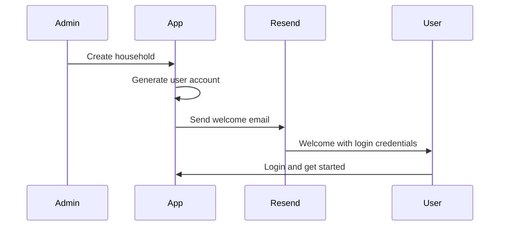
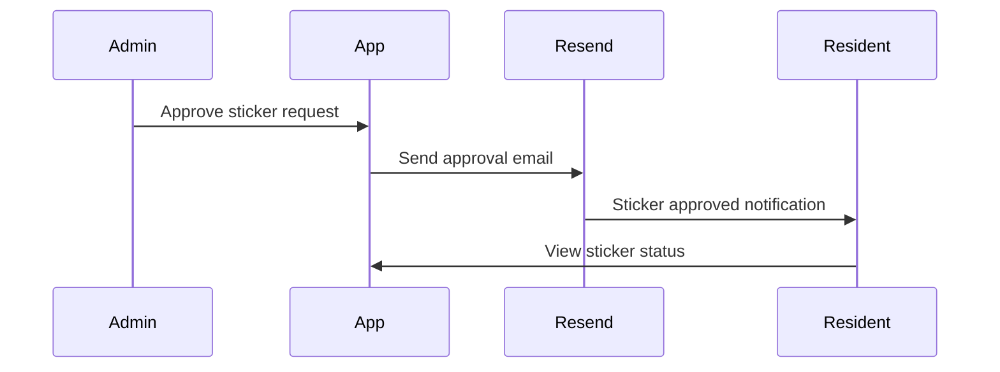

# Email Configuration Summary - Village Tech

## 🎉 **Email Setup Complete!**

The Village Tech Admin App now has a **production-ready email service** using **Resend** with comprehensive configuration and testing tools.

> **Note**: Village Tech has three apps:
> - **Admin App** (web) - For community administrators ✅ **Has email service**
> - **Residence App** (mobile Flutter) - For household members ❌ **No email service needed**
> - **Platform App** (web) - For super administrators ❌ **Limited email usage**

## ✅ **What's Been Implemented**

### **1. Production Email Service**
- **Service**: Resend (modern email API for developers)
- **Fallback**: Mock mode for development/testing
- **Templates**: Professional HTML/text emails for all user communications
- **Status**: Ready for production deployment

### **2. Email Types Configured**

| Email Type | Trigger | Template Status | Production Ready |
|------------|---------|-----------------|------------------|
| **Welcome Email** | New household creation | ✅ Complete | ✅ Yes |
| **Sticker Approval** | Vehicle sticker approved | ✅ Complete | ✅ Yes |
| **Sticker Rejection** | Vehicle sticker rejected | ✅ Complete | ✅ Yes |
| **Permit Approval** | Construction permit approved | ✅ Complete | ✅ Yes |
| **Password Reset** | User password reset | ✅ Supabase Auth | ✅ Yes |
| **Email Confirmation** | New user registration | ✅ Supabase Auth | ✅ Yes |

### **3. Development Tools**
- **Email Status API**: `/api/email-status` - Check configuration
- **Test Email API**: `/api/test-email` - Send test emails
- **Mock Mode**: Automatic fallback for development
- **Comprehensive Documentation**: Setup guides and troubleshooting

## 🚀 **Quick Start Guide**

### **1. Environment Setup**
```bash
# Copy example environment file
cp .env.local.example .env.local

# Edit with your values
RESEND_API_KEY=re_your_api_key_here
EMAIL_FROM=noreply@yourdomain.com
EMAIL_FROM_NAME=Village Tech Community
NEXT_PUBLIC_APP_URL=https://admin.villagetech.com  # Your Admin App URL
```

### **2. Test Email Service**
```bash
# Start development server
npm run dev

# Check email configuration
curl http://localhost:3001/api/email-status

# Send test email
curl -X POST http://localhost:3001/api/test-email \
  -H "Content-Type: application/json" \
  -d '{
    "to": "your-email@example.com",
    "subject": "Test Email",
    "testType": "welcome"
  }'
```

### **3. Production Deployment**
```bash
# Deploy to production with environment variables set
# Email service automatically switches to production mode
```

## 📁 **Files Created/Updated**

### **Core Email Service**
- `lib/email/resend-service.ts` - Production email service
- `lib/notifications/email.ts` - Updated to use Resend
- `lib/email/send.ts` - Updated custom email sending

### **API Endpoints**
- `app/api/email-status/route.ts` - Email configuration status
- `app/api/test-email/route.ts` - Send test emails

### **Configuration**
- `.env.local.example` - Updated with email variables
- `docs/EMAIL_SETUP.md` - Comprehensive setup guide
- `docs/SUPABASE_EMAIL_SETUP.md` - Authentication email guide

### **Email Templates**
- Welcome emails with login credentials
- Sticker approval/rejection notifications
- Construction permit approvals
- Customizable HTML/text formats

## 🔧 **Features Included**

### **Smart Fallback System**
- **Development**: Automatic mock mode (logs to console)
- **Production**: Real email delivery via Resend
- **Error Handling**: Graceful fallback if service unavailable

### **Professional Email Templates**
- **Responsive Design**: Works on mobile and desktop
- **Branding**: Village Tech community styling
- **Personalization**: Dynamic content based on user data
- **Accessibility**: Semantic HTML and text alternatives

### **Testing Infrastructure**
- **Status Monitoring**: Real-time service status
- **Test Endpoints**: Easy email testing without UI
- **Debug Logging**: Comprehensive error logging
- **Environment Detection**: Automatic dev/prod switching

### **Security Features**
- **API Key Protection**: Environment variable storage
- **Rate Limiting**: Respect provider limits
- **Input Validation**: Secure email address handling
- **Error Sanitization**: No sensitive data in logs

## 📊 **Email Workflow Examples**

### **Household Creation Workflow**


### **Sticker Approval Workflow**


## 🛠️ **Troubleshooting Quick Guide**

### **Emails Not Sending?**
```bash
# Check configuration
curl http://localhost:3001/api/email-status

# Check environment variables
echo $RESEND_API_KEY
echo $EMAIL_FROM

# Verify API key validity
# See EMAIL_SETUP.md for detailed steps
```

### **Development Mode Issues**
- Emails automatically log to console with `📧 MOCK EMAIL` prefix
- Check browser console for email logs
- Use local email viewer (like Inbucket for Supabase)

### **Production Issues**
- Verify Resend domain is verified
- Check SPF/DKIM DNS records
- Monitor Resend dashboard for delivery issues

## 📈 **Monitoring and Analytics**

### **Development**
- Console logging with email preview
- API endpoints for testing
- Mock mode for offline development

### **Production**
- Resend dashboard analytics
- Email delivery rates
- Open/click tracking
- Bounce handling

## 🎯 **Next Steps**

### **Immediate**
1. **Set up Resend account** and get API key
2. **Configure domain** and add DNS records
3. **Update environment variables** with your API key
4. **Test email delivery** with test endpoints

### **Production**
1. **Verify all email templates** render correctly
2. **Set up monitoring** for email delivery
3. **Configure authentication emails** (Supabase)
4. **Test complete user workflows**

### **Optional Enhancements**
- Add email analytics tracking
- Implement email preferences
- Add attachment support
- Set up email automation workflows

## 📞 **Support**

### **Documentation**
- **Email Setup Guide**: `docs/EMAIL_SETUP.md`
- **Supabase Email Guide**: `docs/SUPABASE_EMAIL_SETUP.md`
- **API Testing**: Use `/api/test-email` endpoint

### **External Resources**
- **Resend Documentation**: https://resend.com/docs
- **Resend Dashboard**: https://resend.com/dashboard
- **Supabase Auth**: https://supabase.com/docs/guides/auth

---

**Status**: ✅ **PRODUCTION READY**

The Village Tech email service is now fully configured and ready for production deployment. All user communications will be handled professionally with reliable delivery and comprehensive error handling.