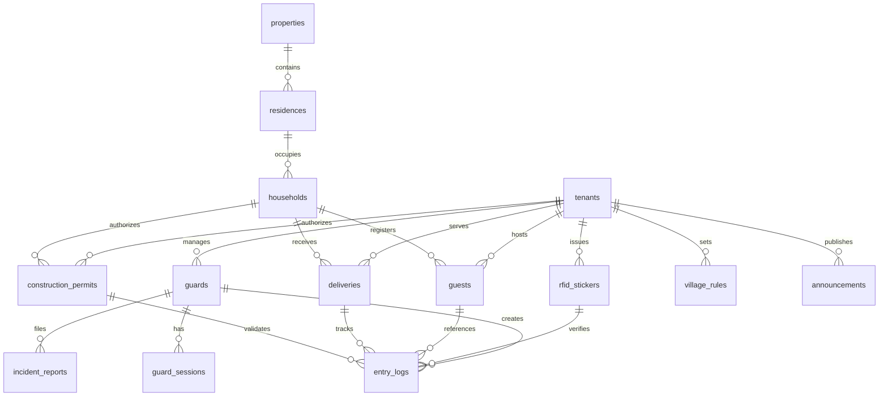

# Data Model: Sentinel App - Gate Guard Access Control

**Date**: 2025-10-19
**Phase**: Phase 1 - Design & Contracts
**Based on**: Feature specification and research findings

---

## Entity Relationships



---

## Core Entities

### 1. Tenant (Community/Village)

**Purpose**: Multi-tenant isolation for residential communities

**Fields**:
```dart
class Tenant {
  String id;                    // UUID
  String name;                  // Community name
  String address;               // Physical address
  String contactEmail;          // Admin contact
  String contactPhone;          // Admin phone
  String subscriptionStatus;    // 'active', 'trial', 'suspended'
  int maxResidences;           // Maximum allowed residences
  DateTime createdAt;           // Creation timestamp
  DateTime updatedAt;           // Last update timestamp
}
```

**Validation Rules**:
- Name: Required, 3-100 characters
- Address: Required, valid physical address
- Email: Required, valid email format
- Phone: Required, valid phone format
- Subscription Status: Must be valid enum value

**State Transitions**:
- trial → active (payment confirmation)
- active → suspended (payment failure, policy violation)
- suspended → active (issue resolution)

### 2. Guard (Gate Security Personnel)

**Purpose**: Gate guard user accounts and authentication

**Fields**:
```dart
class Guard {
  String id;                    // UUID
  String tenantId;              // Tenant association
  String email;                 // Login email
  String fullName;              // Display name
  String role;                  // 'head_guard', 'guard_officer', 'guard_trainee'
  String phone;                 // Contact number
  String employeeId;            // Employee identifier
  bool isActive;                // Employment status
  DateTime? lastLoginAt;        // Last login timestamp
  DateTime createdAt;           // Creation timestamp
  DateTime updatedAt;           // Last update timestamp
}
```

**Validation Rules**:
- Email: Required, valid email format
- Role: Required, valid guard role enum
- Phone: Required, valid phone format
- Employee ID: Required, unique within tenant

**Security Constraints**:
- Row-Level Security: Guards can only access tenant data
- Role-based access: Different permissions per role
- Session management: Secure authentication with timeout

### 3. RFID Sticker (Vehicle Access Control)

**Purpose**: Resident vehicle identification and access control

**Fields**:
```dart
class RfidSticker {
  String id;                    // UUID
  String tenantId;              // Tenant association
  String stickerCode;           // Unique RFID identifier
  String residentId;            // Associated resident
  String vehicleInfo;           // Vehicle make/model/color
  String licensePlate;          // Vehicle license plate
  String status;                // 'active', 'expired', 'disabled', 'lost'
  DateTime issuedAt;            // Issue date
  DateTime expiresAt;           // Expiration date
  DateTime? lastUsedAt;         // Last successful scan
  String issuedByGuardId;       // Guard who issued sticker
  Map<String, dynamic>? metadata; // Additional properties
  DateTime createdAt;           // Creation timestamp
  DateTime updatedAt;           // Last update timestamp
}
```

**Validation Rules**:
- Sticker Code: Required, unique, valid RFID format
- Resident ID: Required, valid resident reference
- Status: Required, valid status enum
- Expires At: Required, future date

**Business Rules**:
- Cannot issue expired stickers
- Lost stickers immediately disabled
- Expiration reminders 30 days before expiry
- Audit trail for all status changes

### 4. Guest (Visitor Management)

**Purpose**: Pre-registered guest access and visitor logging

**Fields**:
```dart
class Guest {
  String id;                    // UUID
  String tenantId;              // Tenant association
  String householdId;           // Hosting household
  String guestName;             // Visitor full name
  String phoneNumber;           // Contact number
  String purpose;               // Visit purpose
  DateTime scheduledDate;       // Expected visit date
  TimeOfDay expectedArrival;    // Expected arrival time
  TimeOfDay expectedDeparture;  // Expected departure time
  String status;                // 'pending', 'checked_in', 'checked_out', 'cancelled'
  String? vehicleInfo;          // Vehicle details if applicable
  String? notes;                // Special instructions
  String approvedByGuardId;     // Guard who approved registration
  DateTime? actualArrival;      // Actual arrival timestamp
  DateTime? actualDeparture;    // Actual departure timestamp
  DateTime createdAt;           // Creation timestamp
  DateTime updatedAt;           // Last update timestamp
}
```

**Validation Rules**:
- Guest Name: Required, 2-100 characters
- Household ID: Required, valid household reference
- Scheduled Date: Required, not in past (for creation)
- Phone: Required, valid phone format

**Business Rules**:
- Can register guests up to 30 days in advance
- Maximum 10 guests per household per day
- Automatic cancellation if not arrived within 2 hours of expected time
- Guest data retention: 90 days after visit

### 5. Delivery (Package & Service Management)

**Purpose**: Delivery tracking and timer management

**Fields**:
```dart
class Delivery {
  String id;                    // UUID
  String tenantId;              // Tenant association
  String householdId;           // Recipient household
  String deliveryCompany;       // Company name
  String deliveryPerson;        // Delivery person name
  String contactPhone;          // Delivery contact
  String packageType;           // 'package', 'food', 'document', 'furniture'
  String? recipientName;        // Specific recipient
  String? specialInstructions;  // Handling instructions
  bool isPerishable;            // Perishable indicator
  DateTime scheduledDate;       // Expected delivery date
  String status;                // 'scheduled', 'in_progress', 'completed', 'cancelled'
  DateTime? arrivalTime;        // Gate entry timestamp
  DateTime? departureTime;      // Gate exit timestamp
  Duration? timeOnSite;         // Calculated duration
  String receivedByGuardId;     // Guard who processed delivery
  String? notes;                // Additional notes
  DateTime createdAt;           // Creation timestamp
  DateTime updatedAt;           // Last update timestamp
}
```

**Validation Rules**:
- Delivery Company: Required, 2-100 characters
- Household ID: Required, valid household reference
- Package Type: Required, valid type enum
- Contact Phone: Required, valid phone format

**Business Rules**:
- Maximum 4 hours on-site for standard deliveries
- Perishable deliveries: Maximum 1 hour on-site
- Automatic alerts when time exceeded
- Delivery history retention: 1 year

### 6. Construction Permit (Worker Access Control)

**Purpose**: Construction project authorization and worker tracking

**Fields**:
```dart
class ConstructionPermit {
  String id;                    // UUID
  String tenantId;              // Tenant association
  String householdId;           // Property under construction
  String projectName;           // Project description
  String contractorName;        // Construction company
  String contractorContact;     // Contractor contact person
  String contractorPhone;       // Contractor phone number
  DateTime startDate;           // Project start date
  DateTime endDate;             // Project end date
  String status;                // 'active', 'completed', 'suspended', 'cancelled'
  List<String> authorizedWorkers; // List of authorized worker names/IDs
  String? workHours;            // Allowed working hours
  String? workAreas;            // Restricted work areas
  String issuedByGuardId;       // Guard who issued permit
  String? notes;                // Special conditions
  DateTime createdAt;           // Creation timestamp
  DateTime updatedAt;           // Last update timestamp
}
```

**Validation Rules**:
- Project Name: Required, 5-200 characters
- Household ID: Required, valid household reference
- Start/End Dates: Required, end date after start date
- Contractor Phone: Required, valid phone format

**Business Rules**:
- Maximum permit duration: 90 days
- Automatic expiry on end date
- Worker entry not allowed outside work hours
- Permit cancellation if household reports issues

### 7. Entry Log (Comprehensive Activity Tracking)

**Purpose**: Complete audit trail of all gate activities

**Fields**:
```dart
class EntryLog {
  String id;                    // UUID
  String tenantId;              // Tenant association
  String guardId;               // Guard who processed entry
  String entryType;             // 'resident', 'guest', 'delivery', 'construction', 'other'
  String personName;            // Name of person
  String? vehicleInfo;          // Vehicle details
  String? rfidStickerId;        // RFID sticker if used
  String? guestId;              // Guest reference if applicable
  String? deliveryId;           // Delivery reference if applicable
  String? constructionPermitId; // Permit reference if applicable
  String destination;           // Destination household/location
  String purpose;               // Entry purpose
  String verificationMethod;    // 'rfid', 'manual', 'phone_call', 'permit'
  String verificationStatus;    // 'verified', 'pending', 'denied'
  DateTime entryTime;           // Entry timestamp
  DateTime? exitTime;           // Exit timestamp
  Duration? durationOnSite;     // Calculated time on site
  String? notes;                // Guard notes
  Map<String, dynamic>? metadata; // Additional data
  bool synced;                  // Server sync status
  DateTime createdAt;           // Creation timestamp
  DateTime updatedAt;           // Last update timestamp
}
```

**Validation Rules**:
- Guard ID: Required, valid guard reference
- Entry Type: Required, valid enum value
- Person Name: Required, 2-100 characters
- Verification Method: Required, valid method enum
- Entry Time: Required, valid timestamp

**Business Rules**:
- All entries must be logged (audit requirement)
- Exit logging mandatory for all entries (except denied)
- Entry logs cannot be deleted, only archived
- Real-time sync for critical security events

### 8. Incident Report (Security & Rule Violations)

**Purpose**: Security incident documentation and escalation

**Fields**:
```dart
class IncidentReport {
  String id;                    // UUID
  String tenantId;              // Tenant association
  String guardId;               // Reporting guard
  String incidentType;          // 'security_breach', 'rule_violation', 'emergency', 'maintenance'
  String severity;              // 'low', 'medium', 'high', 'critical'
  String title;                 // Incident summary
  String description;           // Detailed description
  String location;              // Incident location
  DateTime incidentTime;        // When incident occurred
  String? violatorName;         // Person involved if applicable
  String? violatorInfo;         // Additional violator details
  List<String> photoUrls;       // Photo evidence URLs
  String status;                // 'open', 'investigating', 'resolved', 'closed'
  String? resolutionNotes;      // Resolution details
  String? resolvedByGuardId;    // Guard who resolved
  DateTime? resolvedAt;         // Resolution timestamp
  DateTime createdAt;           // Creation timestamp
  DateTime updatedAt;           // Last update timestamp
}
```

**Validation Rules**:
- Incident Type: Required, valid type enum
- Severity: Required, valid severity enum
- Title: Required, 5-200 characters
- Description: Required, 10-2000 characters
- Location: Required, valid location reference

**Business Rules**:
- Critical incidents trigger immediate admin notifications
- Photo evidence required for security breaches
- Resolution notes mandatory for all incidents
- Incident retention: Minimum 5 years

### 9. Village Rules (Community Guidelines)

**Purpose**: Community rules and guard enforcement guidelines

**Fields**:
```dart
class VillageRule {
  String id;                    // UUID
  String tenantId;              // Tenant association
  String category;              // 'security', 'parking', 'noise', 'amenities', 'general'
  String title;                 // Rule title
  String description;           // Detailed rule description
  String enforcementLevel;      // 'warning', 'fine', 'deny_entry', 'escalate'
  bool isActive;                // Rule status
  int displayOrder;             // Display priority
  String? createdByGuardId;     // Guard who created rule
  DateTime? effectiveFrom;      // Rule effective date
  DateTime? effectiveTo;        // Rule expiry date
  DateTime createdAt;           // Creation timestamp
  DateTime updatedAt;           // Last update timestamp
}
```

**Validation Rules**:
- Title: Required, 5-200 characters
- Description: Required, 10-1000 characters
- Category: Required, valid category enum
- Enforcement Level: Required, valid level enum

### 10. Announcement (Admin Communications)

**Purpose**: Admin announcements and guard notifications

**Fields**:
```dart
class Announcement {
  String id;                    // UUID
  String tenantId;              // Tenant association
  String title;                 // Announcement title
  String content;               // Announcement content
  String priority;              // 'low', 'medium', 'high', 'urgent'
  String targetAudience;        // 'all_guards', 'head_guards', 'specific_guard'
  List<String> targetGuardIds;  // Specific guard targets if applicable
  bool isActive;                // Announcement status
  bool requiresAcknowledgment;  // Must be acknowledged
  List<String> acknowledgedBy;  // Guards who acknowledged
  DateTime scheduledFor;        // When to display
  DateTime? expiresAt;          // When to expire
  String createdByGuardId;      // Guard who created announcement
  DateTime createdAt;           // Creation timestamp
  DateTime updatedAt;           // Last update timestamp
}
```

**Validation Rules**:
- Title: Required, 5-200 characters
- Content: Required, 10-2000 characters
- Priority: Required, valid priority enum
- Scheduled For: Required, future timestamp

---

## Supporting Entities

### Guard Session (Authentication Management)

```dart
class GuardSession {
  String id;                    // UUID
  String guardId;               // Guard reference
  String tenantId;              // Tenant association
  DateTime loginTime;           // Session start
  DateTime? logoutTime;         // Session end
  String? deviceInfo;           // Device identification
  String? ipAddress;            // Network location
  bool isActive;                // Session status
  DateTime createdAt;           // Creation timestamp
}
```

### Sync Queue (Offline Operations)

```dart
class SyncQueue {
  String id;                    // UUID
  String tenantId;              // Tenant association
  String operation;             // 'CREATE', 'UPDATE', 'DELETE'
  String entityType;            // Entity type name
  String entityId;              // Entity identifier
  String payload;               // Serialized data
  String priority;              // 'critical', 'high', 'normal', 'low'
  int retryCount;               // Retry attempts
  DateTime scheduledFor;        // When to process
  DateTime? lastAttemptAt;      // Last retry attempt
  DateTime createdAt;           // Creation timestamp
}
```

---

## Database Schema Design

### Indexing Strategy

**Primary Indexes**:
- All tables: Primary key on `id`
- Tenant tables: Composite index on `tenant_id, created_at`
- Time-based queries: Index on timestamp fields

**Performance Indexes**:
- Entry logs: `tenant_id, entry_time, guard_id`
- RFID stickers: `tenant_id, sticker_code, status`
- Guests: `tenant_id, household_id, scheduled_date`
- Sync queue: `tenant_id, priority, scheduled_for`

### Partitioning Strategy

**Time-based Partitioning** (Entry Logs):
- Monthly partitions for entry_logs table
- Automatic partition creation and cleanup
- Improved query performance for recent data

**Tenant-based Partitioning** (Optional):
- Large deployments may use tenant_id partitioning
- Improves multi-tenant query performance
- Simplified tenant data isolation

### Data Retention Policies

**Short-term Data** (90 days):
- Guest registrations
- Delivery logs
- Construction permits (completed)

**Medium-term Data** (1 year):
- Entry logs
- Guard sessions
- Non-critical incidents

**Long-term Data** (5+ years):
- Security incidents
- Violation reports
- Audit logs

---

## API Contracts Overview

### Authentication Endpoints
- `POST /auth/login` - Guard authentication
- `POST /auth/refresh` - Token refresh
- `POST /auth/logout` - Session termination
- `POST /auth/biometric` - Biometric verification

### RFID Management
- `GET /rfid/stickers` - List RFID stickers
- `POST /rfid/verify` - Verify sticker code
- `PUT /rfid/stickers/{id}` - Update sticker status
- `GET /rfid/stickers/{code}/lookup` - Quick sticker lookup

### Guest Management
- `GET /guests` - List today's guests
- `POST /guests` - Register new guest
- `PUT /guests/{id}/check-in` - Check in guest
- `PUT /guests/{id}/check-out` - Check out guest

### Entry Logging
- `POST /entries` - Create entry log
- `PUT /entries/{id}/exit` - Record exit time
- `GET /entries/search` - Search entry logs
- `GET /entries/today` - Today's entries

### Incident Reporting
- `POST /incidents` - Create incident report
- `PUT /incidents/{id}/resolve` - Resolve incident
- `GET /incidents` - List incidents
- `POST /incidents/{id}/photos` - Upload photos

### Synchronization
- `GET /sync/pending` - Get pending operations
- `POST /sync/operations` - Submit offline operations
- `GET /sync/status` - Sync status check
- `POST /sync/confirm` - Confirm successful sync

### Admin Operations
- `GET /rules` - Get village rules
- `GET /announcements` - Get announcements
- `POST /announcements/{id}/acknowledge` - Acknowledge announcement

---

## Security Considerations

### Row-Level Security (RLS) Policies

**Tenant Isolation**:
```sql
-- Example RLS policy for entry_logs
CREATE POLICY tenant_isolation ON entry_logs
  FOR ALL TO authenticated
  USING (tenant_id = current_setting('app.current_tenant_id')::uuid);
```

**Role-Based Access**:
```sql
-- Example policy for guard role restrictions
CREATE POLICY guard_role_access ON entry_logs
  FOR SELECT TO authenticated
  USING (auth.jwt() ->> 'role' IN ('head_guard', 'guard_officer', 'guard_trainee'));
```

### Data Validation

**Input Sanitization**:
- All user inputs validated and sanitized
- SQL injection prevention with parameterized queries
- XSS prevention for text fields

**Business Logic Validation**:
- Server-side validation for all critical operations
- Consistency checks across related entities
- Audit trail for all data modifications

### Performance Requirements

**Query Performance**:
- RFID verification: <2 seconds
- Guest lookup: <3 seconds
- Entry log creation: <1 second
- Search queries: <5 seconds

**Sync Performance**:
- Batch size: 50 operations per batch
- Sync frequency: Real-time for critical, 5-minute for normal
- Conflict resolution: <10 seconds per conflict

---

## Conclusion

This data model provides a comprehensive foundation for the Sentinel gate guard application with:

1. **Complete audit trail** for all gate activities
2. **Multi-tenant isolation** for security and scalability
3. **Offline-first design** with robust synchronization
4. **Role-based access control** for different guard levels
5. **Extensible design** for future feature additions

The model balances security requirements with operational efficiency, ensuring reliable gate operations while maintaining comprehensive audit capabilities for residential community security management.